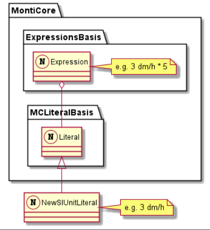
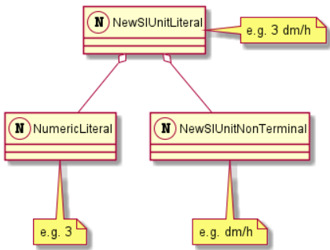
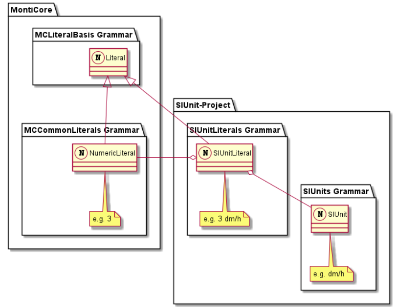
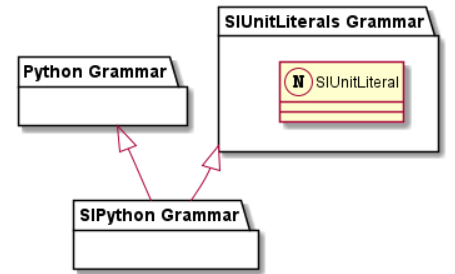
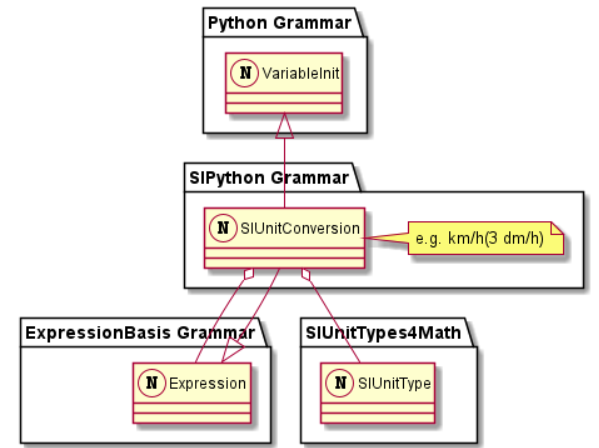
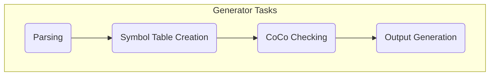

**### Table of Content
1. Introduction (alessandra)
2. Motivation (alessandra)
    1. Problems with SIUnit calculation in software
3. Approach
    1. Description of the solution (alessandra)
        tools, 2 teile aus der grammatik,wie wir die Sprache aufgeteilt haben, nutzen prettyprinter so das es compatible
        ist mit dem pint. mit cocos paar sachen überprüfen.
    2. Languages
        1. Python (alessandra)
            1. Description
            2. Syntax
            3. Grammar
            4. Indentation
            5. Functionality (cocos)
            6. Symbol Table 
        2. SIPython (lennart)
            1. Description
            2. Syntax
            3. Grammar
            4. SIUnits
            5. Functionality (cocos)
    3. Generator (lennart)
        1. description of the prettyprinter
        2. application: showing example use case
6. Discussion
    1. Evaluation of the Python/SIPython language (alessandra)
        1. problems
    2. Comparison (lennart)
        1. with using plain Python + SiUnits library (pint)
    3. Evaluation of using python for unit calculation (lennart)
        1. It's not as efficient as other programming languages
        2. no type checking at compile time
7. Conclusion (alessandra)
    1. summary of previous chapters

# Introduction
The developed project is a python language software that offers support for calculation with si units, 
automated unit compatibility checking, and unit conversion. It supports a verity of SI units, a few examples
are electric units and every type of time units.  
## Motivation
Nowadays most businesses use software in order to improve the revenue and facilitate life. We see software
in most of our day-to-day life, and while software is used in most things nowadays, it is not yet adapted
for all areas. In the scientific environment, even thought not always as obvious is an area that uses 
software as one of the most important tools for facilitating research and production.
However, most common languages, like java or python do not support scientific programming. This results in many problems, 
one of the most common issues arise while using metrics, for example si units. The software does not support it
which means that humans do the conversion, which can lead easily to human errors. Furthermore, whenever scientists
want to check and maybe even continue the work of colleagues, it is not necessarily known what type of si units
the previous scientists used, and it leads to a lot of confusion and mistakes. Mistakes that are not always easy to 
solve or to come back from, the equipment that is in risk is mostly very costly and a little conversion error can go
a long way.

# Motivation

# Approach

## Languages

### Python

### SIPython
With the previously presented language, it is possible to parse python scripts. However, only literals like strings,
characters, numbers, and booleans are supported, as shown in the following code snippet.
```python
c = 'a'
n = 3
b = true
```
The support for si unit literals is still missing. The following code snippets shows an example of a variable assigment expression including a si unit literal, as expected in a python like scripting language.
```python
v = 3 dm/h
```
Therefore, the language SIPython was created, which extends the Python language. As described in the previous section it adds support for si unit literals. For such a language to be used in practice it had to fulfill certain requirements, that we had to identify and solve, illustrated in the following.

#### SI Unit Literals

The first requirement, as previously outlined, is the support for si unit literals. The basic approach would be to introduce a new literal type extending MontiCores Literal nonterminal of the [MCLiteralBasis](https://github.com/MontiCore/monticore/blob/dev/monticore-grammar/src/main/grammars/de/monticore/literals/MCLiteralsBasis.mc4) grammar. This would allow to directly include the new si unit literal in all kinds of expressions extending the Expression nonterminal of the [ExpressionBasis](https://github.com/MontiCore/monticore/blob/dev/monticore-grammar/src/main/grammars/de/monticore/expressions/ExpressionsBasis.mc4) grammar. The described approach with its grammar dependency is shown in the following diagram. Here, the new introduced nonterminal named _NewSIUnitLiteral_ allows to model literals containing si units like `3 dm/h`. Through, the extension of the _Literal_ nonterminal, which in part of the _Expression_ nonterminal it would be possible to express e.g. multiplication expression containing si units like `3 dm/h * 5`.

[//]: # (```plantuml)

[//]: # (package "MontiCore" {)

[//]: # (package "MCLiteralBasis " {)

[//]: # (    class Literal <<&#40;N,transparent&#41;>>)

[//]: # (})

[//]: # ()
[//]: # (package "ExpressionsBasis" {)

[//]: # (    class Expression <<&#40;N,transparent&#41;>>)

[//]: # (    note right: e.g. 3 dm/h * 5)

[//]: # (    )
[//]: # (    Expression o-- Literal)

[//]: # (})

[//]: # (})

[//]: # ()
[//]: # (class NewSIUnitLiteral  <<&#40;N,transparent&#41;>>)

[//]: # (Literal <|-- NewSIUnitLiteral)

[//]: # (note right: e.g. 3 dm/h)

[//]: # (```)



The new si unit literal itself should consist of a numeric literal indicating the value of the literal, and a nonterminal representing the si unit, as shown in the following diagram.

[//]: # (```plantuml)

[//]: # (class NumericLiteral <<&#40;N,transparent&#41;>>   )

[//]: # (note bottom: e.g. 3)

[//]: # ()
[//]: # (class NewSIUnitNonTerminal <<&#40;N,transparent&#41;>>)

[//]: # (note bottom: e.g. dm/h)

[//]: # ()
[//]: # (class NewSIUnitLiteral <<&#40;N,transparent&#41;>>)

[//]: # (note right: e.g. 3 dm/h)

[//]: # ()
[//]: # (NewSIUnitLiteral o-- NumericLiteral)

[//]: # (NewSIUnitLiteral o-- NewSIUnitNonTerminal)

[//]: # (```)




However, the MontiCore team already provides such a nonterminal, as part of their [SIUnits project](https://git.rwth-aachen.de/monticore/languages/siunits). The SIUnit project introduces a full type system for si units to be used in other MontiCore languages. Their approach for modeling si unit literals as a MontiCore grammar corresponds to the previously described approach. The following diagram shows an overview of the defined grammars and their dependencies in the MontiCore domain.

[//]: # (```plantuml)

[//]: # (package "MontiCore" {)

[//]: # (package "MCLiteralBasis Grammar" {)

[//]: # (    class Literal <<&#40;N,transparent&#41;>>)

[//]: # (})

[//]: # ()
[//]: # (package "MCCommonLiterals Grammar" {)

[//]: # (    class NumericLiteral <<&#40;N,transparent&#41;>>   )

[//]: # (    note bottom: e.g. 3)

[//]: # (    )
[//]: # (    Literal <|-- NumericLiteral)

[//]: # (})

[//]: # (})

[//]: # ()
[//]: # (package "SIUnit-Project" {)

[//]: # (package "SIUnits Grammar" {)

[//]: # (    class SIUnit <<&#40;N,transparent&#41;>>   )

[//]: # (    note bottom: e.g. dm/h)

[//]: # (})

[//]: # ()
[//]: # (package "SIUnitLiterals Grammar" {)

[//]: # (    class SIUnitLiteral <<&#40;N,transparent&#41;>>)

[//]: # (    note bottom: e.g. 3 dm/h)

[//]: # (    )
[//]: # (    Literal <|-- SIUnitLiteral)

[//]: # (    SIUnitLiteral o-- NumericLiteral)

[//]: # (    SIUnitLiteral o-- SIUnit)

[//]: # (})

[//]: # (})

[//]: # ()
[//]: # (```)



In the SUnit project, the literal for si units is modeled by the _SIUnitLiteral_ nonterminal. As previously described, it extends the _Literal_ nonterminal of the _MCLiteralBasis_, and is composed of the _NumericLiter_ of the [MCCommonLiterals](https://github.com/MontiCore/monticore/blob/dev/monticore-grammar/src/main/grammars/de/monticore/literals/MCCommonLiterals.mc4) grammar. To model the si unit of the literal, the _SIUnitLiteral_ is additionally composed of the _SIUnit_ nonterminal. _SIUnit_ covers all kinds of si units, including primitive ones like ``dm``, and the division of primitive ones like `dm/h`, as well as the division of a numeric literal and a primitive si unit like `1/h`.

To make use of this approach, we let the SIPython grammar extend the SIUnitLiterals grammar. This leads to the language composition, as shown in the following diagram.

[//]: # (```plantuml)

[//]: # (package "SIUnitLiterals Grammar" {)

[//]: # (    class SIUnitLiteral <<&#40;N,transparent&#41;>>)

[//]: # (})

[//]: # ()
[//]: # (package "SIPython Grammar" {)

[//]: # ()
[//]: # (})

[//]: # ()
[//]: # (package "Python Grammar" {)

[//]: # (})

[//]: # ()
[//]: # ("Python Grammar" <|-- "SIPython Grammar" )

[//]: # ("SIUnitLiterals Grammar" <|-- "SIPython Grammar" )

[//]: # (```)



#### SI Unit Conversions

Now we are able to specify literals containing si units. However, the ability of just specifying such literals is not sufficient for a si unit supporting programming language. As with normal literals like strings or integers, programmers require to perform conversions between types. Conversions between types can be implicit or explicit [^1]. In implicit conversions, the types are automatically converted depending on their use in the code. The following code shows an example of an automatic conversion in python.

[^1]: https://www.programiz.com/python-programming/type-conversion-and-casting

```python
num_int = 123
num_flo = 1.23

num_new = num_int + num_flo
print(num_new)
>>> 124.23
```

Hereby, a calculation between variables of different types, integer and float, is performed. The lower type integer is automatically converted to the higher type float. The result is therefore of type float as well.

In explicit conversion of types, the conversion is explicitly specified in the code. As shown in the following code snippet, explicit conversions in python are performed using special functions.

```python
num_str = int("456")
print(type(num_str))
>>>"<class 'int'>"
```

In this example, a string value is converted to an integer value and assigned to a variable. The variable is now of type integer.

As our language introduces new literals, we have to support implicit and explicit conversions for si units as well.

Although, the SIUnit project introduces si unit literals, it only provides functionalities for implicit conversions of si units for statically typed languages [^2]. This means, it is only usable in static typed languages like Java, where the type of variables are specified in the declaration and never change during runtime.

[^2]: https://git.rwth-aachen.de/monticore/languages/siunits/-/blob/dev/src/main/grammars/de/monticore/SIUnits.md

However, this is not applicable for a python like language, as it is dynamically typed. Hereby, the python interpreter does not necessarily know the type of variables. The following code snippet shows an example situation where implicit type conversions can not be performed during compile time, due to the lack of type information.

```python
def some_method(var1, var2):
    return var2 + var2

some_method(4,5.3)
```

In this snippet, a method declaration with two input parameters is displayed. As the type of the variables are not provided, no type conversions can be performed during the calculation of both paramteres in the input body. Thus, implicit type checking implemented by the SIUnit project is not applicable for the SIPython language.

##### Explicit Type Conversions

Explicit conversions of si units is not supported at all by the SIUnit project. Thus, we had to come up with an own approach for type conversions. This approach is displayed in the following diagram.

[//]: # (```plantuml)

[//]: # (package "ExpressionBasis Grammar" {)

[//]: # (    class Expression <<&#40;N,transparent&#41;>>)

[//]: # (})

[//]: # ()
[//]: # (package "Python Grammar" {)

[//]: # (    class VariableInit <<&#40;N,transparent&#41;>>)

[//]: # (})

[//]: # ()
[//]: # (package "SIUnitTypes4Math" {)

[//]: # (    class SIUnitType <<&#40;N,transparent&#41;>>)

[//]: # (})

[//]: # ()
[//]: # (package "SIPython Grammar" {)

[//]: # (    class SIUnitConversion <<&#40;N,transparent&#41;>>)

[//]: # (    note right: e.g. km/h&#40;3 dm/h&#41;)

[//]: # (    VariableInit <|-- SIUnitConversion)

[//]: # (    Expression <|-- SIUnitConversion)

[//]: # (    SIUnitConversion o-- Expression)

[//]: # (    SIUnitConversion o-- SIUnitType)

[//]: # (})

[//]: # (```)



Here, explicit conversions are modeled by the _SIUnitConversion_ nonterminal. Because, conversions can be used as a normal expression, as well as a variable initialisation, _SIUnitConversion_ implements _VariableInit_ of the _Python_ grammar, as well as _Expression_ nonterminal of the _ExpressionBasis_ grammar. We defined the _SIUnitConversion_ nonterminal itself in the SIPython grammar as follows.

```
SIUnitType "(" Expression ")"
```

An explicit conversion can be made by specifying the target unit of the conversion followed by an expression containing si units. This includes conversions like ``km/h(3 dm/h)`` as well as ``km/h(3 dm/h + 5 m/s)``.

##### Implicit Type Conversions

For implicit conversions we had to come up with an approach at runtime. The only way to archive this is to include specific code in the python script, which is generated from the SIPython script, that is responsible for the conversion of si units. Such code could look like the following pseudocode snippet.

```python
def operation_with_implicit_conversion(var1, var2, operator) {
    higher_type = get_higher_type(var1,var2)
    return operator(convert(var1,higher_type), covert(var2,higher_type))
}

sum = operation_with_implicit_conversion(34,12.34,add)
print(sum)
>>> 46.34
```

Hereby, to perform operations on variables, a special function has to be called, that takes the variables and the operator as input and performs the implicit conversion as previously described. For this approach, it is required, that the si unit of a variable is preserved. For Python this could be archived, by specifying variables as pairs of value and type in the generated Python code. E.g. the SIPython code ``v = 3 dm/h`` would be converted to ``v = (3,"dm/h")``.

However, the described approach for implicit conversions of si units is already implemented by various python libraries, e.g. [siunits](https://pypi.org/project/siunits/), [forallpeople](https://github.com/connorferster/forallpeople), or [astropy](https://uomresearchit.github.io/programming_with_python/06-units_and_quantities/index.html). These libraries introduce new si unit object types and associated conversion and type checking functionalities. For our project we chose the [pint](https://pint.readthedocs.io/en/0.10.1/) library, as it provides an easy-to-use interface, especially important in the code generation process, described in the [Generator section](#generator). The pint, library is imported in the generated python code, and variables are initialized as pint unit objects. When performing calculations on those objects, the pint library performs the implicit conversion automatically.

With the described approach of introducing a explicit conversion nonterminal _SIUnitConversion_, and performing implicit conversions using si unit python libraries in the generated code, we managed to provide type conversion suited for a python like language supporting si units.

#### Compatibility Checking
To this point we described, how we managed to provide si unit literals for our language and to perform type conversions on si units. The third requirement for our SIPython language, is to provide compatibility checking of multiple si unit literals used in the expression. Code like ``3 dm/h + 5 °C`` would lead to unusable results, as the specified types of the addition expression are not compatible. Although, the SIUnit project already provides a compatibility checks for si units, the same problem as for type conversions remains. Only compatibility checks for statically typed languages are provided. As our approach has to be dynamically typed, we can not make use of the provided functionality. However, we can make use of the pint library, as it provides a full type checking system for si units at runtime.

The resulting approach covered all identified requirements for a python like programming language that supporting si unit.

---

## Generator

In the previous section, we illustrated our approach for a Python-like programming language that provides support for si units, containing of the two grammars _Python_ for Python scripts and _SIPython_, an extension of *Python* adding support for si units. In this section, we describe the developed tooling supporting the utilization of the language in parsing and generating python scripts. Our approach follows the recommended model processor architecture, as recommended by the MontiCore team. Its implementation was inspired by the [si unit supporting Java-like programming language](https://git.rwth-aachen.de/monticore/languages/siunits/-/tree/dev/src/test/java/de/monticore/lang/testsijava), developed as part of the SIUnit project.

The main entry class is the [Generator](\src\main\java\de\monticore\sipython\generator\Generator.java). It allows to generate a python scripts from a SIPython scripts. Example use cases are provided in the [GeneratorTest](\src\test\java\de\monticore\sipython\GeneratorTest.java).

The tasks of the Generator class are displayed in the following diagram. First, it parses the input model script, creating an abstract syntax tree, using the generated SIPythonParser class. Next, the symbol table for the input model, as well as imported files and built-in python functions is created. Afterwards, the ast tree is checked against the context conditions, and finally, the output file is generated using the implemented pretty printer.



##### Generation of Python Scripts
As described, the last task of the Generator class is to generate the output Python script. Hereby, the visitor architecture, provided by MontiCore, is used to traverse the parsed AST tree of the input model, and pretty-printing the AST nodes of the input model as valid python expressions. Thus, we had implemented for each generated AST node type of the grammar elements, a corresponding printer function.

For the elements of the Python grammar, the implementation of such printer functions was trivial as the output had to remain the same as the input. In case of printing _SIUnitLiterals_ and _SIUnitConversions_ of the _SIPython_ grammar, the previously described application of the pint library had to be considered.

Thereby, to ensure that the type checking and conversion for si units was performed when running the generated Python script, the si unit objects had to be used when printing _SIUnitLiterals_ and _SIUnitConversions_. Using the pint library si unit objects are created by multiplying the value of the unit with the unit type itself. In pint the unit type can be specified by constants or using a look-up function, that retrieves the type from a passed input string, as shown in the following code snippet.

```python
3 * ureg.meter
3 * ureg("m")
```

Both expressions create si unit objects for the literal ``3 m``.

For printing SIUnitLiterals, we decided to take the later variant of creating si unit objects, using the unit look-up function. This is because, in the created AST nodes of SIUnitLiterals the, the si unit type is provided as a string. Thus, when printing the unit the si unit type just has to be inserted in the look-up function. The following code snippet shows a SIUnitLiteral and its printed python expression using the pint library, as described.

```python
#SIPython code
3 dm/h
```
```python
#generated Python code
3 * ureg("dm/h")
```

In the same way, we implemented the printing of _SIUnitConversions_. For a given conversion expression the input of the conversion is printed, multiplied with the type of the conversion as an ureg expression, as shown in the following example.

```python
#SIPython code
km/h(y)
```
```python
#generated Python code
y * ureg('km/h')
```

To be able to use the pint library each generated scripts contains a corresponding import statement and an intitalisation statement for the ureg function, as shown in the following snippet.

```python
from pint import UnitRegistry
ureg = UnitRegistry()
```

To show how the generated Python script of a SIPython script looks like, the following snippet displays an example SIPython script.

```python
# This is an example script of a unit type supporting python-like language
x = true
import calendar
print(_monthlen(2022, 07))
print("Hello World")
def calculate_velocity(distance, time):
    return distance / time
calculate_velocity(x=1, time=5)
velocity = 3 dm/h
y = velocity + 1 m/s
v1 = km/h(y)
v2 = 4 m/ns^2
print(velocity)
print(calculate_velocity(distance, time))
class calculator:
    def __init__(self):
        self.factor = 1

    def multiply(self, x):
        return self.factor * x
c = calculator()
print(c.multiply(1))
```
Using the described Generator class, the following Python script is generated.

```python
from pint import UnitRegistry
ureg = UnitRegistry()
# This is an example script of a unit type supporting python-like language
x = true
import calendar
print(_monthlen(2022, 07))
print("Hello World")
def calculate_velocity(distance, time):
    return distance / time
calculate_velocity(x = 1, time = 5)
velocity = 3 * ureg('dm/h')
y = velocity + 1 * ureg('m/s')
v1 = y * ureg('km/h')
v2 = 4 * ureg('m/ns^2')
print(velocity)
print(calculate_velocity(distance, time))
class calculator:
    def __init__(self, self):
        self.factor = 1
    def multiply(self, x, self):
        return self.factor * x
c = calculator()
print(c.multiply(1))
```

##### Generator-Tool
To further ease the use of the Generator, we provide a tool that automatically parses a SIPython script, and runs the Python script generated by the Generator class. To use this, the main method of the [Main](\src\main\java\de\monticore\sipython\Main.java) class has to be executed. Hereby, the input SIPython script has to be specified with the following string as input to the main method ``--execute <script>``. With this it is possible to provide an executable jar to possible users of the SIPython language.

---

# Discussion

## Evaluation of the Approach

## MontiCore grammar creates the following problems:
#### 1. Integer Division
When we need to divide 2 numbers in python we separate the two numbers or the two variables by two forward slashes. Two
forward slashes are also used to initialize a comment which is a problem for the component grammar MCBasics. MCBasics 
recognizes the two forward slashes as a start of a single line comment. The integer division is just possible with spaces
around the two forward slashes. Example: 3 // 2

#### 2. Indentation
Monticore grammar skips all ident tokens, we can see this on the MCBasics component, as shown by the figure
below spaces, tabs, paragraphs and carriage returns are skipped since they are not needed. 


However, we need to know when indentation is used and how it is used, 
in order to check if it is used correctly. We also need
to save the indentation in order to use it in our printer and print it correctly.
To solve this problem we added some things to our grammar in order to not skip the indentation, we define
what type of indentation that should not be skipped and implemented functions for functionality.
We implemented an indentation counter in our grammar that checks if the indentation is done
correctly. 

#### 3. Monticore's incompatibility for the Python language 
Monticore is based on the java language, which gave us some incompatibility problems.
The Boolean literals in Monticore are defined, for example, in order to adapt to the java standard of 
boolean values, the difference between booleans on java and booleans on python is the first letter: 'True'
is used in Python, however in Java we use 'true' the same goes for the false statement. The same goes for
the String literals, even though in java we would just use one type of quotation marks: "", in Python 
we can use another type of quotation marks: ''. 

To fix this we defined string literals and boolean literals in our grammar, these literals are
adapted to Python by implementing the differences already mentioned above. 

However, there still remains a problem, since we can not overwrite the original 
grammar the words 'true' and 'false' even though not meaning anything in Python, remain keywords and
can not be used as variable names, which should be working since they do not mean anything in Python. The
only solution is to not use this types of variables.

## Comparison between SIPython and plain Python
Following the evaluation of our approach, it has to be examined how usable the SIPython language and its tooling is, in comparison to the use of plain python with si unit supporting libraries like pint. As this would be the closest alternative for developing software containing si units.

By utilizing our SIPython language the programming of code containing si units becomes way more intuitive. Our approach of specifying the si unit after the value is also used in natural language, in contrast to the si unit pint expressions. As the following example shows our approach of specifying si unit literals is closer related to natural language than the unit expression of the pint libraries.

```python
#SIPython code
velocity = 3 dm/h

#Natural language
"The velocity is 3 dm/h"

#Python code with pint library
velocity = 3 * ureg("dm/h")
```

This is especially beneficial for developers with less software engineering experience. In relation to the intuitivity, the readability of the code increases as well, by using the SIPython language. As the following example shows, using the pint library, the code contains an additional multiply operation and a method call for each si unit, increasing the line length.

```python
#SIPython code
velocity = 3 dm/h + 5 cm/s - 20 m/h

#Python code with pint library
velocity = 3 * ureg("dm/h") + 5 * ureg("cm/s") - 20 * ureg("m/h")
```

On the other side, with the SIPython language, additional steps have to be performed, when executing code. When a programmer wants to run its SIPython code, it has to be parsed, analyzed and converted to python code in addition to the steps of the python interpreter that runs the generated python code. This increases the development process, when testing the developed code. However, the production code should only consist of the generated Python code rather than the SIPython code, to reduce its execution times.

Furthermore, the SIPython language lacks of support for IDEs. Currently, there is e.g. no code highlighting, error checking at development time, or debugging functionality provided. Therefore, developer rely on generating the python code after each change, to use the lacking functionalities.

After comparing the described approaches for using si units in a programming language, we come to the following result. Although, the produced code, using the SIPython language, is more intuitive to write and has an increased readability, we wouldn't recommend to use this approach in production. As previously noted, additional parsing and generation steps are added to the execution process, decreasing the efficiency of python software, which already struggles with performance efficiency. Furthermore, with the lack of provided tooling, supporting the software development, we do not perceive the use of the SIPython language as an improvement of the development process. We would recommend to use plain python and si unit supporting libraries like pint, as this would allow to use the available software development tooling for the Python language, as code highlighting or debugging.

## Evaluation of Unit Calculation with Python

Following, the comparison of using the SIPython language and plain Python with si unit libraries for developing software utilizing si units, we change the level of evaluation and want to discuss the utilization of Python in general for developing software, containing si units.

The major reason for this evaluation is that Python is not well known for its efficiency. As proven by a [study](https://greenlab.di.uminho.pt/wp-content/uploads/2017/09/paperSLE.pdf), Python is not only one of the worst programming languages in case of execution speed, but also regarding energy consumption. Especially, in domains that have to work with si units, where execution speed and energy efficiency may play a more important rule, it is not a beneficial perk for a programming language. As the same study showed, energy consumption and execution speed of programs can be dramatically improved by changing the programming language. Hereby, languages like C or Rust are suitable options.

When questioning the utilization of Python for si unit supported programming, another aspect to consider is its dynamic type system. As the overall goal is to improve the type checking of si unit values in programs, to detect errors earlier, the choice for a programming language that shifts its type checking to the execution phase, is not beneficial. Therefore, we would recommend to utilize statically typed languages for the development of software with si units, like C or Rust. Here, libraries like [unitc](https://github.com/magnusjonsson/unitc) for C, or [dimensioned](https://github.com/paholg/dimensioned) for Rust were developed to provide support for si units.

This evaluation, showed that there exist better alternatives for si unit supporting programming, than using Python. As it lacks of energy effeciciency and execution speed, as well as lead to later error detection due to its dynamically typed system, Python is not the best choice. Languages like C and Rust provide equal support for si units through libraries, have a statically typed system, and have reduced energy consumption and improved execution speed. Therefore, this would be our best choice for a programming language to work with si units.

# Conclusion**