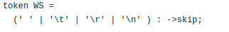

### Table of Content
1. Introduction (alessandra)
2. Motivation (alessandra)
    1. Problems with SIUnit calculation in software
3. Approach
    1. Description of the solution (alessandra)
        tools, 2 teile aus der grammatik,wie wir die Sprache aufgeteilt haben, nutzen prettyprinter so das es compatible
        ist mit dem pint. mit cocos paar sachen überprüfen.
    2. Languages
        1. Python (alessandra)
            1. Description
            2. Syntax
            3. Grammar
            4. Indentation
            5. Functionality (cocos)
            6. Symbol Table 
        2. SIPython (lennart)
            1. Description
            2. Syntax
            3. Grammar
            4. SIUnits
            5. Functionality (cocos)
    3. Generator (lennart)
        1. description of the prettyprinter
        2. application: showing example use case
6. Discussion
    1. Evaluation of the Python/SIPython language (alessandra)
        1. problems
    2. Comparison (lennart)
        1. with using plain Python + SiUnits library (pint)
    3. Evaluation of using python for unit calculation (lennart)
        1. It's not as efficient as other programming languages
        2. no type checking at compile time
7. Conclusion (alessandra)
    1. summary of previous chapters

# Introduction
The developed project is a python language software that offers support for calculation with si units, 
automated unit compatibility checking, and unit conversion. It supports a verity of SI units, a few examples
are electric units and every type of time units.  
## Motivation
Nowadays most businesses use software in order to improve the revenue and facilitate life. We see software
in most of our day-to-day life, and while software is used in most things nowadays, it is not yet adapted
for all areas. In the scientific environment, even thought not always as obvious is an area that uses 
software as one of the most important tools for facilitating research and production.
However, most common languages, like java or python do not support scientific programming. This results in many problems, 
one of the most common issues arise while using metrics, for example si units. The software does not support it
which means that humans do the conversion, which can lead easily to human errors. Furthermore, whenever scientists
want to check and maybe even continue the work of colleagues, it is not necessarily known what type of si units
the previous scientists used, and it leads to a lot of confusion and mistakes. Mistakes that are not always easy to 
solve or to come back from, the equipment that is in risk is mostly very costly and a little conversion error can go
a long way.

The Mars Climate orbiter was a 638-kilogram robotic space probe launched by NASA to study Martian climate, atmosphere, 
and surface changes. However, little time after launch the space probe got lost. An investigation was opened to study 
the reasons of this very expensive failure. This investigation finally attributed the failure to a mismatch between two
metric systems. The piece of ground software supplied by 'Lockheed Martin' produced results in a United States customary
unit, however contrary to that, its Software Interface Specification, supplied by NASA was expecting results to be in 
SI Units, in accordance to their Software. The results were produced in pound-force seconds while it was expected to be 
in newton-seconds.[1]

An issue that cost millions of damage could have been very easy to solve. Having a software that supports conversion of
metrics would just automatically produce the results in the wished system, avoiding any type of further problems. 
Building such a system will be our goal in this project. The result should be a software that supports programming in 
python while using si units.
[1] https://en.wikipedia.org/wiki/Mars_Climate_Orbiter

## Tools
To achieve the goal we used a variety of tools.
### Monticore
Monticore is a language workbench for the efficient development of domain-specific languages. Monticore enabled
us to define our language, Python, and use it together with the MontiCore-framework to build domain specific
tools, like for example integrating our SI Units in the language. We could take advantage of the predefined language 
components that Monticore comes with. Monticore creates the basic grammar and provides all components (statements, literls, etc.).
Monticore then generates a parser that can check if the si python scripts are correct.
[2] https://monticore.github.io/monticore/
### SI Units Project 
The SI Units Project sets the grammar so that it can be read by Monticore, it mainly describes which units are valid and specifies 
what can be used as metric units.
It builds on top of Monticore and allows the parsing of si units, si expressions and pretty printers. 
### Pint 
Pint is a Python package to define, operate and manipulate physical quantities. It allowed us to implement arithmetic
operations between them and conversions from and to different units. It supports a lot of numpy mathematical operations
without monkey patching or wrapping numpy.Important to note it runs in Python 3.8+ with no other dependencies[3] Pint's 
main job will be checking if the units match, if they can be converted and if the types match. Thanks to pint we can 
avoid conversion errors like those that happened with the Mars Climate Orbiter.
[3] https://pint.readthedocs.io/en/stable/
# Approach

## Languages

### Python

### SIPython

## Generator

# Discussion

## Evaluation of the Approach

## MontiCore grammar creates the following problems:
#### 1. Integer Division
When we need to divide 2 numbers in python we separate the two numbers or the two variables by two forward slashes. Two
forward slashes are also used to initialize a comment which is a problem for the component grammar MCBasics. MCBasics 
recognizes the two forward slashes as a start of a single line comment. The integer division is just possible with spaces
around the two forward slashes. Example: 3 // 2

#### 2. Indentation
Monticore grammar skips all ident tokens, we can see this on the MCBasics component, as shown by the figure
below spaces, tabs, paragraphs and carriage returns are skipped since they are not needed. 

However, we need to know when indentation is used and how it is used, 
in order to check if it is used correctly. We also need
to save the indentation in order to use it in our printer and print it correctly.
To solve this problem we added some things to our grammar in order to not skip the indentation, we define
what type of indentation that should not be skipped and implemented functions for functionality.
We implemented an indentation counter in our grammar that checks if the indentation is done
correctly. 

#### 3. Monticore's incompatibility for the Python language 
Monticore is based on the java language, which gave us some incompatibility problems.
The Boolean literals in Monticore are defined, for example, in order to adapt to the java standard of 
boolean values, the difference between booleans on java and booleans on python is the first letter: 'True'
is used in Python, however in Java we use 'true' the same goes for the false statement. The same goes for
the String literals, even though in java we would just use one type of quotation marks: "", in Python 
we can use another type of quotation marks: ''. 

To fix this we defined string literals and boolean literals in our grammar, these literals are
adapted to Python by implementing the differences already mentioned above. 

However, there still remains a problem, since we can not overwrite the original 
grammar the words 'true' and 'false' even though not meaning anything in Python, remain keywords and
can not be used as variable names, which should be working since they do not mean anything in Python. The
only solution is to not use this types of variables.

## Other Problems:

#### 1. Function Overload
Function overloading is a feature that exists in a lot of programming languages. It is using different 
functions with different implementations, however with the same name. Depending on the context that the 
function is called, it executes the different implementations. An example would be: doSomething() and
doSomething(Obj o), this two functions have the same name however are considered as two different functions,
normally with different types of implementations, one not needing an object and the other one needing it.
Another example could be: doSomething(String s) and doSomething(Int i), here we change the types of the 
arguments in the function, and considering these types the functions do different things. 

We could not implement this in our project. To succeed in implementing this feature, the symbol table 
must be adapted to prevent duplicate
function symbols with the same name. However, symbol merging is not recommended since in this case,
scopes would be merged together and so would also all variables. Further checks would be impossible to 
make and this prevented us to implement this feature. The only solution around this is to not
use this feature. 

#### 2. Tuples without parentheses
In Python, we can use tuples with different number of arguments and with or without parentheses. An example 
to visualize this would be using this type of tuple: var = (1,4,5), this works in Python and can be used without
problems like this, however, we can also use it like this: var = 1,4,5. When printing this tuples like this:
print(var), the same result should appear: the tuple with parentheses, like this: (1,4,5). However, this
was impossible for us to implement due to a 'forbidden left recursion' error that is thrown. We suspect the 
reason for this issue being that context free grammars can not be recursive on the left of statements.

#### 3. End of File 
Our statements always end with an End of Line token. An End of Line token consists of one or more paragraphs or
carriage returns, or both. We defined this in our grammar for all statements. However, when the file ends
we do not have an end of line token. In this case we would need an End of file token in order for a problem
not to arise at the end of files. Nonetheless, the end of file token did not work for us even though
we tried a set of 
variations of how to define it. 

## Comparison

## Evaluation of Unit Calculation with Python

# Conclusion